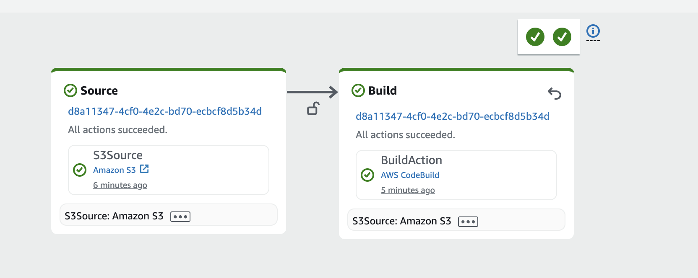
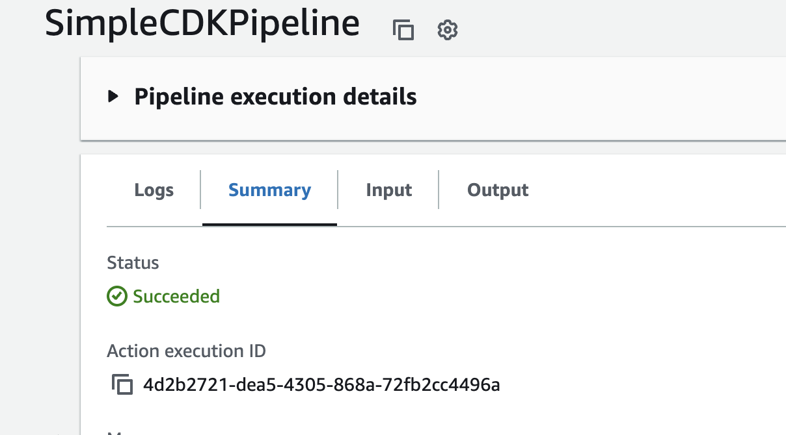
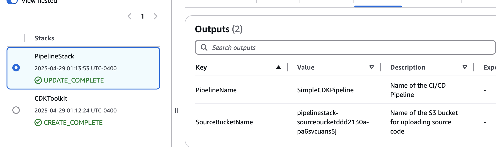
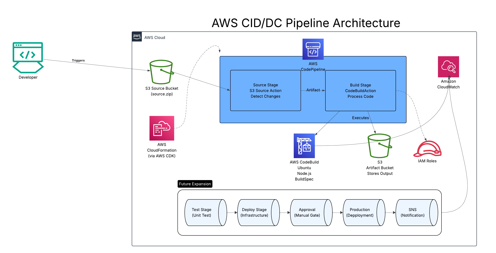

# 🚀 Continuous Integration/Continuous Deployment with AWS


🔗 **Not Live:** The pipeline created in this project is designed to be free-tier compatible and can be decommissioned after demonstration to avoid any AWS charges.

## 📋 Project Overview

This project implements a complete CI/CD (Continuous Integration/Continuous Deployment) pipeline using AWS services to automate the deployment of infrastructure defined with AWS CDK. It demonstrates how modern cloud teams can automate the entire process from code commit to production deployment without manual intervention.

The pipeline automatically builds, tests, and deploys code changes whenever they are uploaded to an S3 bucket, following DevOps best practices while remaining accessible to those without extensive coding experience.

---

## ✅ Key Features & Services

- 🔄 **AWS CodePipeline** - Orchestration of the entire CI/CD workflow
- 🏗️ **AWS CodeBuild** - Managed build service for compiling and testing code
- 🪣 **AWS S3** - Object storage for source code and artifacts
- 🚀 **AWS CDK** - Infrastructure as Code with JavaScript
- 🔐 **AWS IAM** - Fine-grained access control for pipeline components
- 📊 **AWS CloudWatch** - Comprehensive logging and monitoring
- 📦 **AWS CloudFormation** - Automatic provisioning of AWS resources

---

## 🖥️ Pipeline in Action





The screenshots above show the complete CI/CD pipeline in action, demonstrating successful code detection, validation, build, and deployment of infrastructure changes.

---

## 🗺️ Architecture Overview



The architecture follows modern DevOps practices by creating a fully automated workflow:

1. **Source Stage**: Connected to an S3 bucket to detect code changes
2. **Build Stage**: Validates and processes code using CodeBuild with Ubuntu environment
3. **Future Expansion**: Framework for extending to additional stages as needed

This architecture eliminates manual deployment errors, ensures consistent infrastructure, and accelerates the feedback loop for development teams.

---

## 📁 Project Structure

```
aws-cicd-pipeline-infrastructure/
├── pipeline/                    # CDK code for the pipeline itself
│   ├── bin/
│   │   └── pipeline.js          # Main CDK pipeline application
│   ├── lib/
│   │   └── pipeline-stack.js    # Pipeline infrastructure stack
│   ├── package.json             # CDK dependencies
│   └── cdk.json                 # CDK configuration
├── test-source/                 # Sample source code for testing the pipeline
│   ├── index.js                 # Simple JavaScript file
│   ├── README.md                # Source code documentation
│   └── source.zip               # Packaged source code for S3 upload
├── architecture/                # Architecture diagrams and screenshots
│   ├── pipeline-successful-execution.png
│   ├── build-logs-success.png
│   ├── cloudformation-outputs.png
│   └── aws-cicd-architecture-diagram.svg
├── docs/                        # Additional documentation
│   └── logical-flow.md          # Pipeline logical flow explanation
├── .gitignore                   # Git ignore configuration
└── README.md                    # Project documentation
```

---

## 🚀 Deployment Process

### Prerequisites
- AWS CLI configured with appropriate permissions
- Node.js v16+ and npm
- AWS CDK v2 installed globally

### Step 1: Set up the project structure
```bash
mkdir -p aws-cicd-pipeline-infrastructure/{pipeline/{bin,lib},test-source,architecture,docs}
cd aws-cicd-pipeline-infrastructure
```

### Step 2: Initialize the pipeline CDK project
```bash
cd pipeline
npx cdk init app --language javascript
```

### Step 3: Update dependencies
```bash
npm install aws-cdk-lib @aws-cdk/aws-codebuild @aws-cdk/aws-codepipeline @aws-cdk/aws-codepipeline-actions @aws-cdk/aws-iam @aws-cdk/aws-s3
```

### Step 4: Replace pipeline-stack.js with our implementation
Copy the provided `pipeline-stack.js` code to `pipeline/lib/pipeline-stack.js`

### Step 5: Deploy the pipeline infrastructure
```bash
cdk bootstrap  # First-time only
cdk deploy
```

### Step 6: Create and upload test code
```bash
cd ../test-source
echo "console.log('Hello from CI/CD Pipeline!');" > index.js
echo "# CI/CD Pipeline Demo" > README.md
echo "This is a simple demo of an AWS CI/CD pipeline." >> README.md
zip -r source.zip *
aws s3 cp source.zip s3://YOUR-SOURCE-BUCKET-NAME/source.zip
```

### Step 7: Monitor pipeline execution
Navigate to the AWS CodePipeline console to watch your pipeline run.

---

## 🧠 Skills Demonstrated

- CI/CD Pipeline Architecture and Configuration
- Infrastructure as Code Automation
- DevOps Best Practices Implementation
- AWS CodePipeline and CodeBuild Integration
- S3 Event-Triggered Workflows
- Build Environment Configuration
- Troubleshooting and Debugging AWS Cloud Services

---

## 📝 Lessons Learned

- **Environment Compatibility**: AWS CodeBuild environments require careful configuration to handle Node.js applications. Ubuntu environments offer better compatibility with modern Node.js versions compared to Amazon Linux environments.
  
- **GLIBC Dependency Management**: Newer versions of Node.js require more recent GLIBC libraries than what's available in some build environments. Using Node.js 16 on Ubuntu 20.04 provides a reliable combination.

- **S3 as Source Control**: For simple pipeline demonstrations, using S3 as a source provides more reliable and straightforward integration compared to GitHub, especially when working within free tier constraints.

- **Simplified Pipeline Structure**: Starting with a minimal pipeline focusing on source and build stages establishes a foundation that can be expanded with additional stages as needed.

- **Infrastructure as Code Troubleshooting**: Error messages from AWS services can be cryptic, but iteratively testing and refining infrastructure code leads to robust deployments.

---

## 📚 Additional Resources

- [AWS CodePipeline Documentation](https://docs.aws.amazon.com/codepipeline/latest/userguide/welcome.html)
- [AWS CodeBuild Documentation](https://docs.aws.amazon.com/codebuild/latest/userguide/welcome.html)
- [AWS CDK Documentation](https://docs.aws.amazon.com/cdk/latest/guide/home.html)
- [Best Practices for CI/CD](https://aws.amazon.com/builders-library/automating-safe-hands-off-deployments/)

---

## 🔗 Related Projects

- [AWS ECS Fargate Application](https://github.com/jimmyperalta-dev/aws-ecs-fargate-application)
- [Serverless API with AWS Lambda & DynamoDB](https://github.com/jimmyperalta-dev/aws-serverless-dynamodb-api)
- [Infrastructure as Code with AWS CDK](https://github.com/jimmyperalta-dev/aws-cdk-infrastructure)

---

## 👤 Author

**Jimmy Peralta**  
🛠 Associate Media Systems Engineer || ☁️ AWS Cloud Enthusiast  
🌐 [https://www.deployjimmy.com](https://www.deployjimmy.com)
